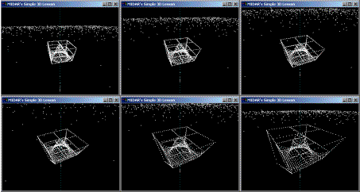



## A 3D Lesson v4, Advanced

### Description

Learn how to program in 3D using only Visual Basic - no OpenGL or DirectX. The major update in version 4 is the synchronization of MIDI music (2001 - A Space Odyssey) and 3D animation. I also wanted to experiment with some opening credits at the beginning. You can press the ESC key to skip the animation.

The other major change is the various Camera variables have been cleaned up and placed into their own data type: 'mdr3DCamera'. You might also notice that I've created some additional data types (ie. mdr3DObject, mdrPolyhedron & mdrVertex). This is in anticipation of getting rid of the dots, and creating some lines drawings... should be exciting!

Thanks go to everyone that has voted for my previous versions (look them up, they are easier than this one). The votes have helped me continue to improve this 3D application.
 
### More Info
 

             |
---                |---
**Submitted On**   |2003-08-05 02:28:40
**By**             |[Peter Wilson](https://github.com/Planet-Source-Code/PSCIndex/blob/master/ByAuthor/peter-wilson.md)
**Level**          |Advanced
**User Rating**    |4.8 (120 globes from 25 users)
**Compatibility**  |VB 6\.0
**Category**       |[Graphics](https://github.com/Planet-Source-Code/PSCIndex/blob/master/ByCategory/graphics__1-46.md)
**World**          |[Visual Basic](https://github.com/Planet-Source-Code/PSCIndex/blob/master/ByWorld/visual-basic.md)
**Archive File**   |[A\_3D\_Lesso162408842003\.zip](https://github.com/Planet-Source-Code/peter-wilson-a-3d-lesson-v4-advanced__1-47394/archive/master.zip)

